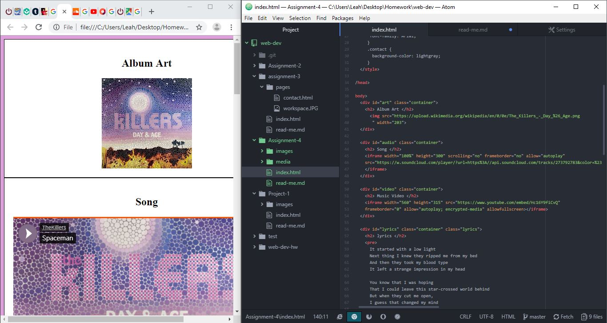

# Technical Report

### divs, classes, ids, spans

Divs create a 'group' of information. ids identify that group as unique. classes identify aspects of the Divs that are similar to each other. Spans are smaller, but similar to Divs. They
organize content together.

### Alt text

Alt text serves as an image description for images you put on your sites. The text will show if the image can't and can be used for accessibility. For example, people who are blind or visually impaired will still know what image is on their screen because their screen reader will read the alt text for them.

### My work week

My work week was Simple. I spent a few days reading the material. I started working on the live site on Sunday. There weren't any major bugs or issues I ran into.

