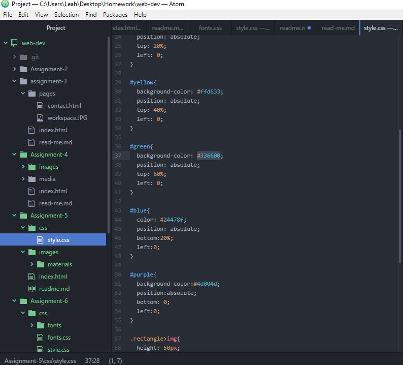

# Read Me! Assignment 5

## design trends

For my project, I focused on the 70's. I noticed a recurring theme of faded rainbows. I used this as my inspiration.

## Colors

I chose the colors #ffcc66, #cc0000, and #336600. They felt like the faded aura of the decade.

## work cycle

This work cycle was rough. I had quite a few syntax errors that took me a long time to work out. They were small things, A missing hyphon here, a dropped bracket there. Overall, I worked through it.

