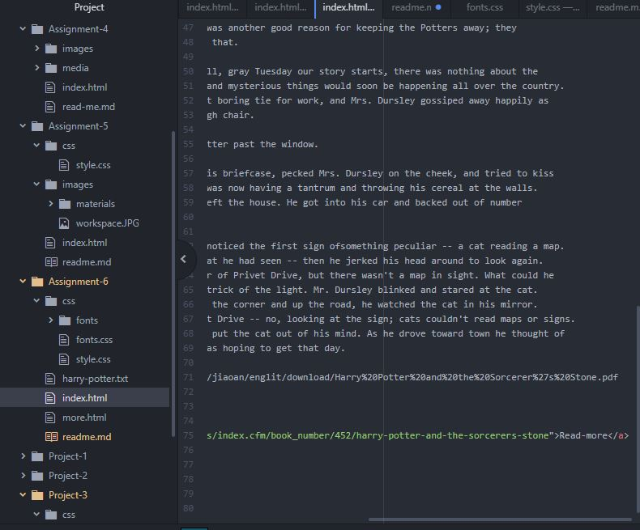

# Read Me! Assignment 6

### Process
My design process was just a matter of looking at fonts and deciding which may look ok together.

### fonts
A system font is designed for the system you're using. A web font is designed for the browsers dispay. The importance of a fall back font is if the brower cannot find the given font, it will have a font to display.

### Work week

This assignment was hard as I struggled to get my fonts to appear on the screen. You'll see I have a few extra fonts in my font folder because of this. Eventually I worked it out.

