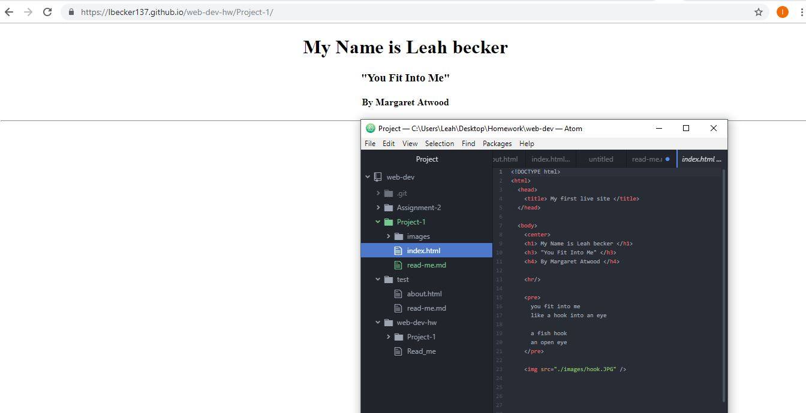

# Leah Becker's Read Me

### What Browsers I Use

I use Chrome and Safari for my computer and phone respectively. A browser is
essentially the middle man between the code and the finished project. It configures the
webpage based on the code and presents it to the user.

### Wayback Machine

I visited a few sites such as github to see how the started. guthub's oldest screenshots
were from 2008. I visited whitehouse.gov to see a site before the 2000's. It lacks the graphic design elements considered common place on the internet today. The background for example was a repeated book image. It does not fit into modern standards for design.

### My work week

This week went about as smooth as last week. I went through the website information on Thursday and finished the project on Monday. The biggest snag in the road for me was a snaffoo in titling my directories. I had a 'web-dev-hw' directory within my 'web-dev-hw' repo which meant I couldn't access my site. I simply moved my project directory out of the 'web-dev hw' repo to fix the error. The issue is, I cannot delete the original extra folder, so it will still show up in my repo.

