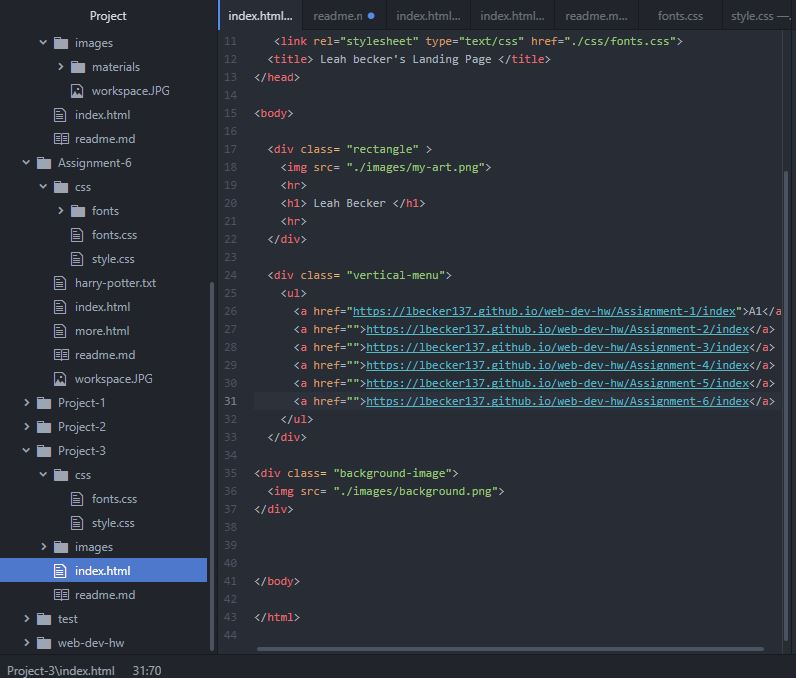

# Read me! Project 3

### What is the difference between padding, margin, and borders?

The Difference is that margins refers to the inner outline of an element, the padding is the outer space. Borders are essentially an outline.

C.) What was the hardest task for you to accomplish this assignment? For example, was it overlapping elements, working with sizing, creating layout, or something else entirely?

The links were the hardest part. I had a tough time figuring out how to put them horizontal. Then I couldn't figure out how to make them a new color. Thus they are purple on the site. I couldn't fix it.

D.) Summarize your work cycle for this assignment. Review this page if you need some ideas.

My work cycle was mostly review of content and brainstorming. I had a page layout in mind before I started. I then had to debug to make it look ok.

