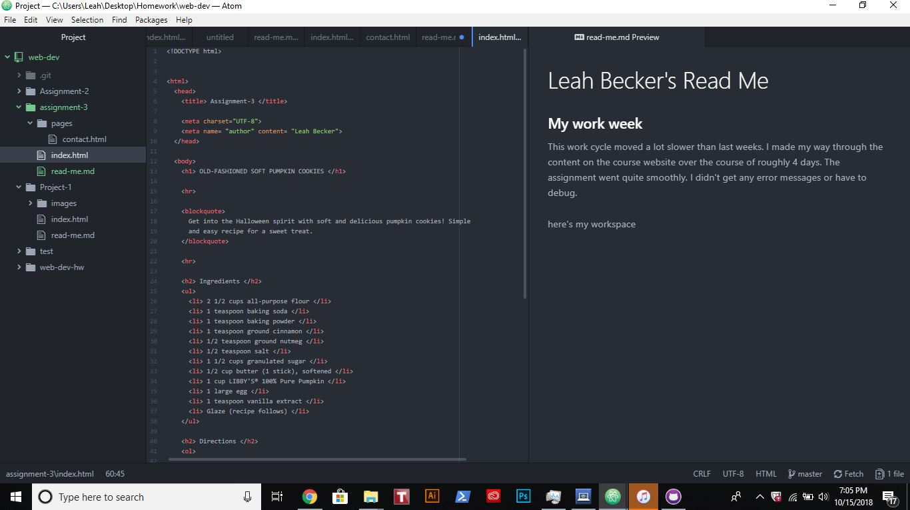

# Leah Becker's Read Me

### Head and body elements

Head and body elements should be used only once. The purpose of a head element is
to define your site. Here you give the site it's title and any relevant information to
the complete site. The body is the 'meat' of the site. Here is where the information for the
viewer goes

### Structural vs Semantic

Structural Markup refers to the actual structure of the page. This includes things like paragraphs or links. Semantic markup adds tone to a page. This includes things such as
italics or bolded text. 

### My work week

This work cycle moved a lot slower than last weeks. I made my way through the content
on the course website over the course of roughly 4 days. The assignment went quite smoothly.
I didn't get any error messages or have to debug.

